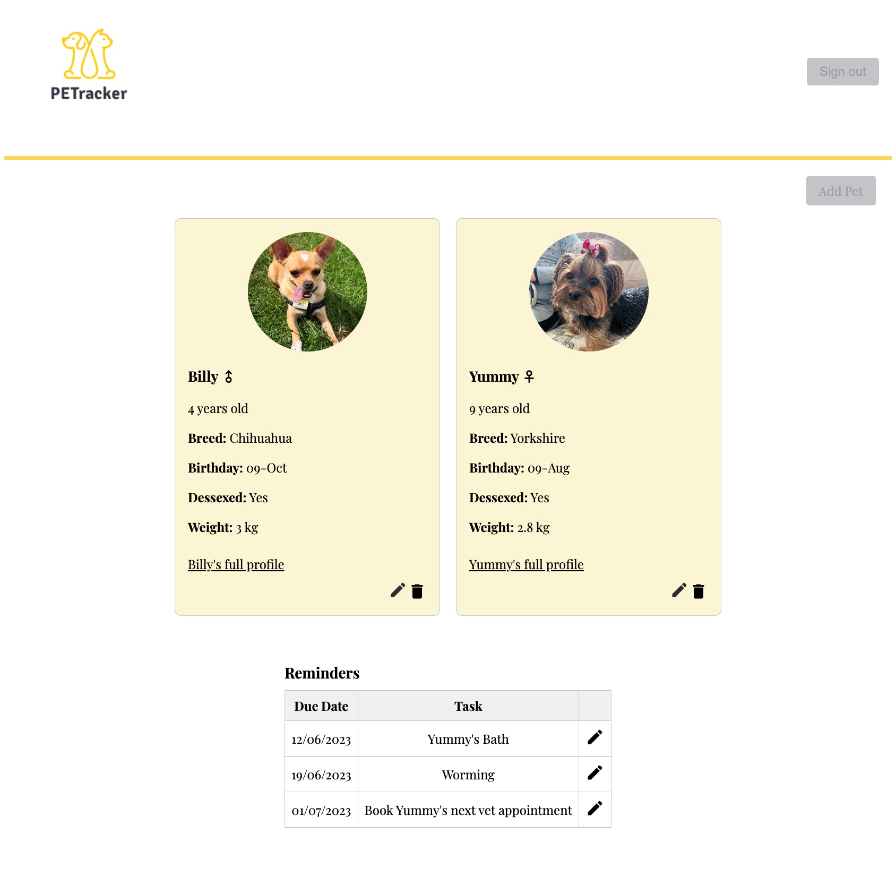

# Project - PETracker

Full-stack Application. 
Tech stack: React and Supabase.

Final Project submission for [General Assembly](https://generalassemb.ly) Software Engineering Course (end of Unit 4). 

To check my project's demo go to this [link](https://majestic-parfait-d3caa8.netlify.app).

 

### **The technical requirements for this project were:**
---
* Be a complete product, which means that it is usable from head-to-tail, in the environment it is meant for.
* Persist data in some way, whether with Postgres or something we haven't covered in class and one you want to learn.
* Implement partial to full CRUD the app has to allow users to add, share, modify or organise some kind of data for some useful purpose.
* Have an interactive front-end written in React (with React Router if URLs make sense for your app).
* Have passing tests for some core logic and/or components.
* Not be your personal portfolio website.Use a NodeJS server that provides a JSON REST API

### Features:
---
Allow users to login or sign up if they don't have an account
Allow users to view their pages once logged in
Once logged in, users can see their pets with basic information as well as their reminders. 
Users can navigate through their pet's full profile where they will be able to see more information such as weight history, vet visits. Inside the pet's profile they will be able to update and delete some information too.

##### Future implementation:
- Make the app responsive to small screens
- Add activity logs and feeding schedules
- Add external APIs to generate random facts about the user's pet breed
- Calendar integration or reminders to be sent out
- Deploy the app live

### **Planning**
---

1. Choose an idea to work on: A PETracker Application to support users to store pet's important data for future reference.

2. Define which technologies to use: For Front-end React with React Router + Back-end with Supabase

3. Define the requirements and plan app functionalities: User authentication, Pet cards, pet profile, weight history, vet visits, reminders, activity logs, feeding schedule. Figma wireframe - [here](https://www.figma.com/file/C2i30aV7d0MwZ4cELlamUh/Job-tracker-(Copy)?type=whiteboard&node-id=0-1&t=0QTJGoVF7A3SO1Nz-0)

4. User Stories and agile environment: Trello - [here](https://trello.com/b/TwVwdIbf/petracker-user-story-board)

5. Plan data model:
- Users
- Pets
- Reminders
- Vet Visits 
- Weight History

6. Deploy online wih Netlify.

#### **Technologies used**
---
- React vite framework
- Node Express
- Supabase
- CSS

#### **Instructions**
---
- Installation:
1. Clone this repo.
2. Run `npm i` to install all dependencies
3. Start the `vite` server with `npm run dev`

#### **Final Considerations**
---
In implementing my final project for the Software Engineering bootcamp, I chose to enhance my skills and add value to my application by learning and utilizing Supabase. Despite the initial challenges and time constraints that came with learning a new technology, I am satisfied with the outcome for my presentation. Supabase proved to be a valuable tool, and I look forward to further exploring its capabilities and maximizing its potential in future projects.

Completing this project has been a rewarding experience that allowed me to apply the knowledge and skills acquired throughout the bootcamp journey. It served as a platform to showcase my understanding of various software engineering concepts and methodologies, covering the entire software development lifecycle from requirement gathering to system design, implementation, and testing.

Throughout the development process, I faced both challenges and triumphs. Effective time management was crucial due to the limited timeframe allocated for the project. Balancing competing priorities and delivering a functional and polished application within the given timeframe presented a significant challenge. However, this experience emphasized the importance of effective planning, prioritization, and adaptability in a real-world development environment.

The final result of my project is satisfactory, and I am happy with the outcome. However, I recognize that there is always room for improvement in any software project. Moving forward, I plan to enhance the application by incorporating additional functionalities and addressing areas that can be further optimized.

Overall, my final project for the Software Engineering bootcamp, coupled with the implementation of Supabase, has provided me with valuable insights and growth as a software engineer. I am confident that the skills and experiences gained during this project will serve as a solid foundation for my future endeavors in software development.
